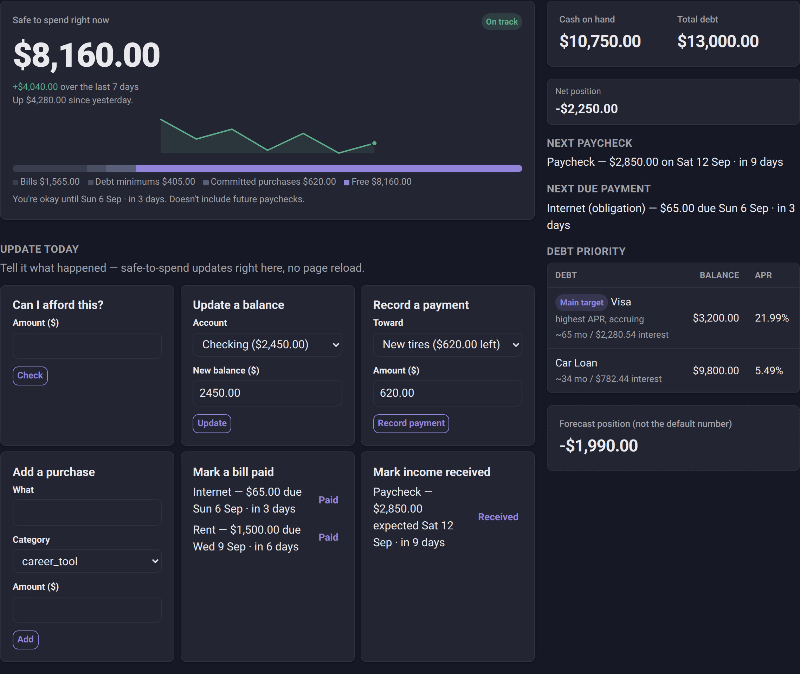

# Cash-Commitment & Runway Tracker

**A private, self-hosted dashboard for real cash position — not a generic budgeting app.**

> [!NOTE]
> Personal project, currently private. Screenshot below is from a seeded demo
> database, not real data. Built and driven with [Claude Code](https://claude.com/claude-code).

It answers one question honestly: **what's actually safe to spend right now**, after
accounting for upcoming bills, ordered-but-not-yet-billed purchases, debt minimums,
and other money that's already spoken for. Future paychecks are never counted in the
main number — they only show up in a separate, clearly-labeled forecast view.

Most budgeting apps show you a balance. That balance is a lie by omission: it doesn't
know about the rent due Friday, the tool you ordered but haven't been billed for yet,
or the credit card minimum coming out next week. This app treats cash-in-hand and
cash-that's-already-spoken-for as two different numbers, and never lets hopeful
future income blur the line between them.

---

## What it looks like

<p align="center">
  
</p>

## What's actually shipped, versus what's still theoretical

| | Area | Notes |
|---|---|---|
| ✅ | **Core calculation engine** | Safe-to-spend, reserved cash, debt priority ranking — live in production, covered by the test suite. |
| ✅ | **"Today" quick actions** | Update a balance, record a payment, add a purchase, mark a bill paid — one screen, htmx, no page reload. |
| ✅ | **Auth** | Password + TOTP (authenticator app), Argon2id hashing, per-device session list with revoke, admin role for account management. |
| ✅ | **PWA** | Installable, offline-safe static asset caching, Web Push notifications. |
| ✅ | **Export / backup** | Per-table CSV, full JSON backup with a real tested restore path. |
| ✅ | **Security review** | Passed a dedicated review before bank-sync went live; re-reviewed 2026-09-03 after several feature additions. Full log kept outside this repo. |
| 🚧 | **SimpleFIN bank sync** | Built and exercised end-to-end — but only against SimpleFIN's public demo endpoint. No real bank has been connected yet. |
| ❌ | **Public registration** | Deliberately not built. The only ways to create a user are a CLI script or an admin-gated form — see [`ARCHITECTURE.md`](./ARCHITECTURE.md). |

## Try it

```bash
python3 -m venv .venv
.venv/bin/pip install -r requirements.txt
.venv/bin/python -m scripts.init_db <username> <password>   # creates the schema + first user
.venv/bin/uvicorn app.main:app --reload
```

Open `http://127.0.0.1:8000`. See [`DEVELOPMENT.md`](./DEVELOPMENT.md) for the full
local dev workflow, running tests, and where to look first if you're picking this
codebase up cold.

## What it does

- **"Today" is a cockpit, not a database editor** — the home screen lets you update
  an account balance, record a payment toward a purchase, add a purchase, or mark a
  bill paid, all from one place. Safe-to-spend updates in the same response, no page
  reload.
- **Safe-to-spend**, computed as cash on hand minus everything already reserved
  (unpaid bills due within your window, debt minimum payments, and committed
  purchases), minus an optional protected savings floor. Allowed to go negative —
  that's a real signal, not a bug.
- **Debts, obligations, committed purchases, and income events** — full CRUD for
  each, grouped into a 4-item nav (Home / Money / Activity / More) instead of a flat
  module list.
- **Recurring bills and income roll forward automatically** — mark a recurring
  obligation paid or a recurring paycheck received, and it advances to its next due
  date on its own.
- **Debt priority ranking** — interest-accruing debt (and anything with unknown or
  promo terms, treated as maximally risky) ranked above flexible/no-interest debt,
  with a manual pin override for when you know better than the algorithm.
- **A dashboard that leads with a signal, not a spreadsheet** — an On track/Negative
  badge and a hand-rolled trend sparkline (no JS charting library) built from daily
  auto-captured snapshots.
- **Forecast / what-if** — a separate, clearly-labeled view backed by an in-memory
  overlay that reuses the exact same calculation engine as the real numbers, so it
  can never silently drift from them. Nothing is saved until you confirm it for real.
- **Settings** — the reserved-cash window (next-paycheck / end-of-month /
  fixed-days), protected savings floor, forecast window and income-confidence
  threshold, timezone, and active-session management, all configurable per user.

## Design principles

- **Future income never counts toward the primary number.** The dashboard's
  safe-to-spend figure uses only cash already in accounts; forecasted income only
  ever appears in the separate what-if/forecast view.
- **Money is integer cents, everywhere.** No floats touch a dollar amount.
- **Single-user in behavior, multi-tenant-ready in schema.** No *public*
  registration route exists or ever will; every domain table is scoped by
  `user_id`, so a second or third person can be added with one CLI command or from
  an admin-gated form — each gets a fully isolated account, no shared/household
  view.

## Stack

FastAPI, SQLite (raw `sqlite3`, no ORM), Jinja2, HTMX (vendored locally, no CDN
dependency). No SPA build step, self-hosted on a single VPS.

## Documentation map

- [`ARCHITECTURE.md`](./ARCHITECTURE.md) — the living spec: data model, calculation
  rules, layering, screens, and deployment, as they currently stand.
- [`IMPLEMENTATION_HISTORY.md`](./IMPLEMENTATION_HISTORY.md) — the build log: what
  shipped when, why, and what broke along the way.
- [`DEVELOPMENT.md`](./DEVELOPMENT.md) — local setup, common commands, project layout.
- [`CLAUDE.md`](./CLAUDE.md) — architecture and conventions for AI coding agents
  working in this repo.
- [`MAKING_PUBLIC.md`](./MAKING_PUBLIC.md) — checklist for if this repo is ever made
  public (it's currently private).
- [`IDEAS.md`](./IDEAS.md) — living backlog of feature ideas/intentions, triaged each
  session; `ARCHITECTURE.md` remains the source of truth for what's actually built.
- [`codex.md`](./codex.md) — brief for running the local `codex` CLI as an idea
  generator against this project; its output lands in `IDEAS.md`, not code.
- `snapshot.md` — combined dump of the docs above, for pasting into another AI
  chat/tool. Regenerate with `.venv/bin/python -m scripts.make_snapshot` — don't
  hand-edit it.

## License

[GNU GPLv3](./LICENSE). Copyright © 2026 flyboy-byte. Free to use, study, and
modify — any distributed derivative work must stay open source under the same
license (copyleft), per GPLv3's own terms.
